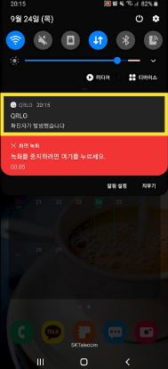

# __QRLO__

## Description
2020 국민 생활무제 해결을 위한 솔·직 챌린지 예선통과작 
>고객 휴대폰으로 QR코드 생성 후 점주 휴대용 기기 카메라에 인식
-> 점주 QR코드 생성 후 부착, 고객 QRLO 앱으로 인식

-------

## Body
* 기존 방식의 문제점
1. 점주들마다 QR코드를 찍는 용도의 기기를 따로 구비해야한다.
2. 네이버, 카카오톡 등의 SNS 계정이 없는 층(외국인 등)이 있다.

 
 

* 새로운 방식 시나리오
1. 점주들이 앱에서 자신의 매장의 정보를 담은 QR코드를 만든다.
2. QR코드를 출력 후 가게에 붙인다.
3. 고객들은 앱으로 QR코드를 인식하고, 필요할 경우 자가진단서를 작성한다.
4. QR코드에 있는 매장정보와 현재 위치를 비교해 일치할 경우 방문내역이 기록된다.
5. 확진자가 있을 경우 점주와 고객 모두에게 앱에서 메세지가 간다.

 
 

* 기대해볼 효과
1. QR코드와 방문기록을 한 앱에서 통제할 수 있다.
2. 너무 많은 요청으로 인해 꺼져있는 재난문자 대신 알림을 줄 수 있다.
3. 상용화될 경우 앱을 키기만 하면 메인화면이 카메라 인식이기 때문에 간편하다.

* 시연화면
1. 메인화면 - 자가진단표 - 방문기록  

3. QR코드 목록 - QR코드 정보 - 알림메세지 

